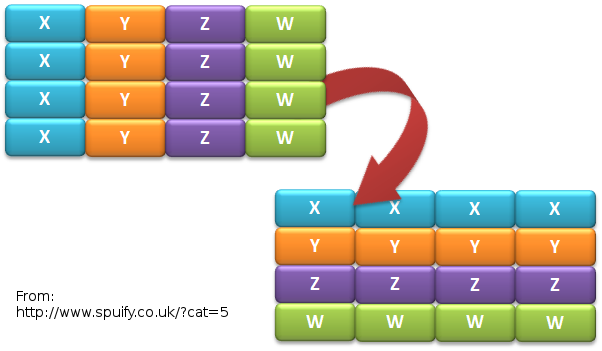

.. What's New in High-Performance Python? slides file, created by
   hieroglyph-quickstart on Sat Apr 30 21:13:03 2016.

Accelerating Python code with Numba and LLVM
============================================

Graham Markall

Compiler Engineer, `Embecosm <http://www.embecosm.com/>`_

`graham.markall@embecosm.com <mailto:graham.markall@embecosm.com>`_

Twitter: `@gmarkall <https://twitter.com/gmarkall>`_

Overview
--------

My background:

* Now: Compiler Engineer at Embecosm - GNU Toolchains
* Previously: Engineer at Continuum Analytics
    - Numba user, and Numba developer
* Background in Python libraries for HPC (PyOP2, Firedrake)

This talk is an overview of:

- **Numba**: a Python compiler focused on numerical code
- **llvmlite**: a lightweight LLVM Python binding for writing JIT compilers
- Feedback / comments welcomed!

What is Numba? (1)
------------------

A tool that makes Python code go faster by specialising and compiling it.

* Mainly focused on array-oriented and numerical code
* Heavily object-oriented, dynamic code not the target use case
* Alternative to using native code (e.g. C-API or CFFI) with C, Fortran, or
  Cython.
* Keeping all code as Python code:

  - Allows focus on algorithmic development
  - Minimise development time

What is Numba? (2)
------------------

* It's *opt-in*: Numba only compiles the functions you specify

  - Not a whole-program compiler like PyPy or V8
  - Not a tracing JIT - always compiles before execution

* Trade off: relaxing the semantics of Python code in return for performance.
* Deliberate narrow focus to handle CPU and non-CPU targets in reasonable way.

Implementation overview
-----------------------

* JIT compiler for Python based on LLVM
* Targets CPUs, CUDA GPUs, HSA APUs
* CPython 2.7, 3.4, 3.5

  - Runs side-by-side with Numpy, Scipy, etc ecosystem

* BSD licensed
* Linux / OS X / Windows
* Development sponsored by:

  - `Continuum Analytics <https://www.continuum.io/>`_
  - `The Gordon and Betty Moore Foundation <https://www.continuum.io/blog/developer-blog/gordon-and-betty-moore-foundation-grant-numba-and-dask>`_

Who uses Numba?
---------------

- Scientists, engineers, anyone interested in numerical modelling
- 135,560 PyPI downloads
- ??? Conda downloads

Random selection of users:

- `OSPC TaxBrain <https://www.youtube.com/watch?v=pZBhyO-djfc>`_ - tax policy
  analysis
- `Primerize <https://primerize.stanford.edu>`_ - DNA sequence PCR assembly
- `Fatiando a Terra <http://www.fatiando.org/>`_ - Geophysics modelling
- `FreeKiteSim <https://bitbucket.org/ufechner/freekitesim>`_ - Interactive kite
  simulator

Numba example
-------------

.. code-block:: python

    # Mandelbrot function in Python

    def mandel(x, y, max_iters):
        c = complex(x,y)
        z = 0j
        for i in range(max_iters):
            z = z*z + c
            if z.real * z.real + z.imag * z.imag >= 4:
                return 255 * i // max_iters

        return 255

Numba example
-------------

.. code-block:: python

    # Mandelbrot function in Python using Numba
    from numba import jit

    @jit
    def mandel(x, y, max_iters):
        c = complex(x,y)
        z = 0j
        for i in range(max_iters):
            z = z*z + c
            if z.real * z.real + z.imag * z.imag >= 4:
                return 255 * i // max_iters

        return 255

Mandelbrot, 20 iterations
-------------------------

============================= =====
CPython                       1x
Numpy array-wide operations   13x
Numba (CPU)                   120x
Numba (NVidia Tesla K20c)     2100x
============================= =====

.. image:: /mandel.png

Other examples
--------------

Times in msec:

================ ======= ===== =======
Example          CPython Numba Speedup
================ ======= ===== =======
Black-Scholes    969     433    2.2x
Check Neighbours 550      28   19.9x
IS Distance      372      70    5.4x
Pairwise          62      12    5.1x
================ ======= ===== =======

Dispatch process
----------------

Calling a ``@jit`` function:

1. Lookup types of arguments
2. Do any compiled versions match the types of these arguments?

  a. Yes: retrieve the compiled code from the cache
  b. No: compile a new specialisation

3. Marshal arguments to native values
4. Call the native code function
5. Marshal the native return value to a Python value

Dispatch overhead
-----------------

.. code-block:: python

    @jit
    def add(a, b):
        return a + b

    def add_python(a, b):
        return a + b

.. code-block:: python

    >>> %timeit add(1, 2)
    10000000 loops, best of 3: 163 ns per loop

    >>> %timeit add_python(1, 2)
    10000000 loops, best of 3: 85.3 ns per loop

Compilation pipeline
--------------------

.. image:: /archi2.png
    :width: 400

Type Inference
--------------

* Native code is statically typed, Python is not
* Numba contains mappings of input to output types, e.g.:

.. code-block:: python

   float32 + float32 -> float32
   int32   + float32 -> float64

- Propagates type information using the data flow graph

.. code-block:: python

    def f(a, b):   # a:= float32, b:= float32
        c = a + b  # c:= float32
        return c   # return := float32

Type Unification
----------------

Example typing 1:

.. code-block:: python

    def select(a, b, c):  # a := float32, b := float32, c := bool
        if c:
            ret = a       # ret := float32
        else:
            ret = b       # ret := float32
        return ret       # return := {float32, float32}
                          #           => float32

Type Unification
----------------

Example typing 2:

.. code-block:: python

    def select(a, b, c):  # a := tuple(int32, int32), b := float32,
                          # c := bool
        if c:
            ret = a       # ret := tuple(int32, int32)
        else:
            ret = b       # ret := float32
        return ret       # return := {tuple(int32, int32), float32}
                          #           => XXX

LLVM Interface
==============

LLVM-PY
-------

- Early versions of Numba used `LLVMPY <http://www.llvmpy.org/>`_
- Supported LLVM 3.2 / 3.3 using a C++ interface
- Downsides:

  * Errors hard to understand (e.g. segfaults / aborts)
  * Heavyweight, complicated interface
  * Difficult to roll forward

- Support for LLVM 3.4 onwards stalled...

llvmlite
--------

- llvmlite user community (examples):

   * `M-Labs Artiq <https://github.com/m-labs/artiq>`_ - control system for
     quantum information experiments
   * `PPC <https://github.com/sodabeta7/Python-Pascal-Compiler>`_ -
     Python Pascal Compiler
   * Various university compilers courses
   * Numba!

- `Kaleidoscope tutorial implementation <https://github.com/eliben/pykaleidoscope/>`_
- Lightweight interface to LLVM though IR parser
- IR builder reimplemented in pure Python

  * isolated from faster-changing LLVM C++ APIs

- LLVM versions 3.5 - 3.8 supported

CUDA Backend
------------

- Numba CUDA backend uses NVVM (LLVM 3.4)
- Numba builds LLVM 3.8 IR to pass to LLVM 3.4
- Text-based substitutions:

  * Remove `argmemonly`, `norecurse`...
  * Add `metadata` type prefix back
  * Change `getelementptr ty, ty* ptr,` to `getelementptr ty *ptr,`
  * ... and several more

- A better way? Bitcode compatibility?
- Other users of multiple LLVM versions at once?

Auto-vectorization
------------------

- Question: How do you get the best out of LLVM's autovectorisation passes?
- Are there high-level code transformations to make it easier for them?

Wrap-up
=======

Towards Numba 1.0 release
-------------------------

- Support for more Python language features (list comprehensions, dicts, ...)
- Support more of the commonly-used NumPy API
- Extension API: for adding new data types without modifying Numba itself
- Usability / debugging improvements
- Numba Cookbook

llvmlite future directions
--------------------------

- Working with the llvmlite user community
- Open to patches and contributions to improve it for other usecases
- llvmlite Github: https://github.com/numba/llvmlite

Further Reading / Information
-----------------------------

- Numba manual / changelog: http://numba.pydata.org/numba-doc/latest/index.html
- Numba tutorial talk video: https://www.youtube.com/watch?v=q45JJ8BXP2g
- Numba tutorial slides: http://gmarkall.github.io/tutorials/pycon-uk-2015/#1
- Examples and exercises: https://github.com/gmarkall/tutorials/tree/master/pycon-uk-2015
- Newer Numba features talk (6 min onwards): https://www.youtube.com/watch?v=-5NUMvkYBNY
- Corresponding examples: https://github.com/gmarkall/tutorials/tree/master/pydata-london-2016/examples

Questions / discussion summary
------------------------------

* Fixups / compatibility across multiple LLVM version
* How to produce code sympathetic to autovectorizer's needs?
* llvmlite usecases / potential users?
* Observations / comparisons to other language bindings?

Extra Slides
============

Supported Python Syntax
-----------------------

Inside functions decorated with `@jit`:

* if / else / for / while / break / continue
* raising exceptions
* calling other compiled functions (Numba, Ctypes, CFFI)
* generators!

Unsupported Python Syntax
-------------------------

Also inside functions decorated with `@jit`:

* try / except / finally
* with
* (list, set, dict) comprehensions
* yield from

Classes cannot be decorated with `@jit`.

Supported Python Features
-------------------------

* Types:

    - int, bool, float, complex
    - tuple, list, None
    - bytes, bytearray, memoryview (and other buffer-like objects)

* Built-in functions:

    - abs, enumerate, len, min, max, print, range, round, zip

Supported Python modules
------------------------

* Standard library:

    - cmath, math, random, ctypes...

* Third-party:

    - cffi, numpy

Comprehensive list: http://numba.pydata.org/numba-doc/0.21.0/reference/pysupported.html

Supported Numpy features
------------------------

* All kinds of arrays: scalar and structured type

    - except when containing Python objects

* Allocation, iterating, indexing, slicing
* Reductions: argmax(), max(), prod() etc.
* Scalar types and values (including datetime64 and timedelta64)
* Array expressions, but no broadcasting
* See reference manual: http://numba.pydata.org/numba-doc/0.21.0/reference/numpysupported.html

Writing Ufuncs
--------------

* Numpy Universal Function: operates on numpy arrays in an element-by-element fashion
* Supports array broadcasting, casting, reduction, accumulation, etc.

.. code:: python

    @vectorize
    def rel_diff(x, y):
        return 2 * (x - y) / (x + y)

Call:

.. code:: python

    a = np.arange(1000, dtype = float32)
    b = a * 2 + 1
    rel_diff(a, b)

Generalized Ufuncs
------------------

* Operate on an arbitrary number of elements. Example:

.. code:: python

    @guvectorize([(int64[:], int64[:], int64[:])], '(n),()->(n)')
    def g(x, y, res):
        for i in range(x.shape[0]):
            res[i] = x[i] + y[0]

* No return value: output is passed in
* Input and output layouts: ``(n),()->(n)``
* Before ``->``: Inputs, not allocated. After: outputs, allocated
* Also allows in-place modification

Layout examples
---------------

Matrix-vector products:

.. code:: python

    @guvectorize([(float64[:, :], float64[:], float64[:])],
                  '(m,n),(n)->(m)')
    def batch_matmul(M, v, y):
        pass # ...

Fixed outputs (e.g. max and min):

.. code:: python

    @guvectorize([(float64[:], float64[:], float64[:])],
                  '(n)->(),()')
    def max_min(arr, largest, smallest):
        pass # ...

Modes of compilation
--------------------

* *Nopython mode*: fastest mode, which all the restrictions apply to
* *Object mode*: supports all functions and types, but not much speedup
* For nopython mode:
  - Must be able to determine all types
  - All types and functions used must be supported
* Force nopython mode with `@jit(nopython=True)`

Loop lifting
------------

* In object mode, Numba attempts to extract loops and compile them in nopython mode.
* Good for functions bookended by nopython-unsupported code.

.. code-block:: python

    @jit
    def sum_strings(arr):
        intarr = np.empty(len(arr), dtype=np.int32)
        for i in range(len(arr)):
            intarr[i] = int(arr[i])
        sum = 0

        # Lifted loop
        for i in range(len(intarr)):
            sum += intarr[i]

         return sum

Tips 0 - Profiling
------------------

* Profiling is important
* You should only modify functions that take a significant amount of CPU time
* use cProfile then line_profiler
* gprof2dot handy for getting an overview

.. image:: /gprof2dot.png

Tips 1 - General Approach
-------------------------

* Start off with just jitting it and see if it runs
* Use `numba --annotate-html` to see what Numba sees
* Start adding `nopython=True` to your innermost functions
* Try to fix each function and then move on

    - Need to make sure all inputs, outputs, are Numba-compatible types
    - No lists, dicts, etc

* Don't forget to assess performance at each state

Tips 2 - Don't Specify Types
----------------------------

* In the past Numba required you to specify types explicitly.
* Don't specify types unless absolutely necessary.
* Lots of examples on the web like this:

.. code-block:: python

    @jit(float64(float64, float64))
    def add(a, b):
        return a + b

* :code:`float64(float64, float64)` *probably unnecessary*!

Tips 3 - Optimisations
----------------------

.. code-block:: python

    for i in range(len(X)):
        Y[i] = sin(X[i])
    for i in range(len(Y)):
        Z[i] = Y[i] * Y[i]

1. Loop fusion:

.. code-block:: python

    for i in range(len(X)):
        Y[i] = sin(X[i])
        Z[i] = Y[i] * Y[i]

2. Array contraction:

.. code-block:: python

    for i in range(len(X)):
        Y = sin(X[i])
        Z[i] = Y * Y

Tips 4 - Debugging
------------------

* Numba is a bit like C - no bounds checking.
* Out of bounds writes can cause very odd behaviour!
* Set the env var ``NUMBA_DISABLE_JIT=1`` to disable compilation
* Then, Python checks may highlight problems

Tips 5 - Releasing the GIL
--------------------------

* N-core scalability by releasing the Global Interpreter Lock:

.. code-block:: python

    @numba.jit(nogil=True)
    def my_function(x, y, z):
        ...

* No protection from race conditions!
* Tip: use concurrent.futures.ThreadPoolExecutor on Python 3
* See ``examples/nogil.py`` in the Numba distribution

New Numba Features (0.18 - 0.25)
--------------------------------

Including:

* Parallel / cuda ufuncs and gufuncs
* Generated JIT functions
* JIT classes
* CFFI support
* Extending Numba with overloading
* Improved support for use with Spark and Dask
* More Numpy functions supported in nopython mode

Parallel & CUDA ufuncs / gufuncs
--------------------------------

.. code::

   @vectorize([float64(float64, float64)])
   def rel_diff_serial(x, y):
        return 2 * (x - y) / (x + y)

   @vectorize(([float64(float64, float64)]), target='parallel')
   def rel_diff_parallel(x, y):
       return 2 * (x - y) / (x + y)

For 10^8 elements, on my laptop (i7-2620M, 2 cores + HT):

.. code::

   %timeit rel_diff_serial(x, y)
   # 1 loop, best of 3: 556 ms per loop

   %timeit rel_diff_parallel(x, y)
   # 1 loop, best of 3: 272 ms per loop

Parallel / CUDA (g)ufunc guidelines
-----------------------------------

- Add ``target='parallel'`` or ``target=cuda`` to ``@vectorize`` decorator
- Need to specify argument types (`Issue #1870 <https://github.com/numba/numba/issues/1870>`_)

  - Incorrect: ``@vectorize(target='parallel')``)
  - Correct: ``@vectorize([args], target='parallel')``
- Parallel target: speedup for all but the most simple functions
- CUDA target: overhead of copy to and from device

Generated functions
-------------------

- Dispatch to different function implementations based on type
- Inspired by Julia's generated functions

Dispatch based on argument:

- type (a scalar, an array, a list, a set, etc.)
- properties (number of dimensions, dtype, etc.)

Generated function example: (1/3)
---------------------------------

1-norm for scalar, vector and matrix:

.. code::

   def scalar_1norm(x):
       '''Absolute value of x'''
       return math.fabs(x)

   def vector_1norm(x):
       '''Sum of absolute values of x'''
       return np.sum(np.abs(x))

   def matrix_1norm(x):
       '''Max sum of absolute values of columns of x'''
       colsums = np.zeros(x.shape[1])
       for i in range(len(colsums)):
           colsums[i] = np.sum(np.abs(x[:, i]))
       return np.max(colsums)

Generated function example (2/3)
--------------------------------

JITting into a single function using ``@generated_jit``:

.. code::

   def bad_1norm(x):
       raise TypeError("Unsupported type for 1-norm")

   @generated_jit(nopython=True)
   def l1_norm(x):
       if isinstance(x, types.Number):
           return scalar_1norm
       if isinstance(x, types.Array) and x.ndim == 1:
           return vector_1norm
       elif isinstance(x, types.Array) and x.ndim == 2:
           return matrix_1norm
       else:
           return bad_1norm

Generated function example (3)
------------------------------

Calling the generated function:

.. code::

   # Calling

   x0 = np.random.rand()
   x1 = np.random.rand(M)
   x2 = np.random.rand(M * N).reshape(M, N)

   l1_norm(x0)
   l1_norm(x1)
   l1_norm(x2)

   # TypeError("Unsupported type for 1-norm")
   l1_norm(np.zeros((10, 10, 10))

Generated functions guidelines
------------------------------

- Looks in ``numba.types`` to see types and attributes
- Example types: ``Array``, ``Number``, ``Integer``, ``Float``, ``List``
- Example attributes: array ``ndim``, array ``dtype``, tuple ``dtype`` or
  ``types``
- ``Buffer`` is the base for a lot of things, including ``Array``
- Always have a "fallback" case that raises an error
- Missing case in type dispatch resulting in return value of ``None``:

.. code::

   File "/home/pydata/anaconda3/envs/pydata/lib/python3.5/inspect.py", line 2156,
            in _signature_from_callable
       raise TypeError('{!r} is not a callable object'.format(obj))
   TypeError: None is not a callable object

JIT Classes
-----------

- Useful for holding related items of data in a single object
- Allows transforming *Array-of-Structs* to *Struct-of-Arrays*
- Can improve performance when accessing a particular member of every entry
- AoS to SoA article from Intel:
  https://software.intel.com/en-us/articles/memory-layout-transformations

JIT Class AoS to SoA example (1/3)
----------------------------------

Original AoS layout using a structured dtype:

.. code::

   dtype = [
       ('x', np.float64),
       ('y', np.float64),
       ('z', np.float64),
       ('w', np.int32)
   ]

   aos = np.zeros(N, dtype)

   @jit(nopython=True)
   def set_x_aos(v):
       for i in range(len(v)):
           v[i]['x'] = i

   set_x_aos(aos)

JIT Class SoA to AoS example (2/3)
----------------------------------

.. code::

   vector_spec = [
       ('N', int32),
       ('x', float64[:]),
       ('y', float64[:]),
       ('z', float64[:]),
       ('w', int32[:])
   ]

   @jitclass(vector_spec)
   class VectorSoA(object):
       def __init__(self, N):
           self.N = N
           self.x = np.zeros(N, dtype=np.float64)
           self.y = np.zeros(N, dtype=np.float64)
           self.z = np.zeros(N, dtype=np.float64)
           self.w = np.zeros(N, dtype=np.int32)

   soa = VectorSoA(N)

JIT Class SoA to AoS example (3/3)
----------------------------------

.. code::

   # Example iterating over x with the AoS layout:

   @jit(nopython=True)
   def set_x_aos(v):
       for i in range(len(v)):
           v[i]['x'] = i

   # Example iterating over x with the SoA layout:

   @jit(nopython=True)
   def set_x_soa(v):
       for i in range(v.N):
           v.x[i] = i

JIT Class guidelines
--------------------

- Use for holding collections of related data
- Reducing the number of parameters to a ``@jit`` function
- Or for performance gain through AoS to SoA transformation
- Using ``_`` or ``__`` not supported yet - see `PR #1851 <https://github.com/numba/numba/pull/1851>`_
- Common error: assigning to an undeclared field or field of the wrong type
- Example: spec says ``np.int32``, assigning ``np.float64``:

.. code::

   numba.errors.LoweringError: Failed at nopython
       (nopython mode backend)
   Internal error:
   TypeError: Can only insert i32* at [4] in
       {i8*, i8*, i64, i64, i32*, [1 x i64], [1 x i64]}:
       got float*

CFFI and Numba
--------------

- C Foreign Function Interface for Python (CPython & PyPy)
- Reads C header files and generates Python interface
- PDL 2015: Romain Guillebert - "Why C extensions are evil"

Two modes:

- Inline: wrapper generated and compiled at runtime
- Out-of-line: at runtime a previously-compiled wrapper is loaded

CFFI / Numba demo
-----------------

- Goal: wrap Intel's Vector Maths Library (VML) and use it from Numba
- VML is a fast library for computations on arrays

  - e.g. sin, cos, exp, sqrt, etc.
- Wrapping by hand would be very time consuming

*Note:* this is an example of a general procedure to wrap a library and use it
with Numba. The demo won't run without VML development files.

Accelerate from Continuum provides VML functions as ufuncs.

CFFI Guidelines
---------------

- Use the preprocessor to do the work for you
- Numba "just works" with inline modules because it can obtain type info
- Out-of-line modules requires ``register_module``
- For struct types, use ``register_type`` to tell Numba how to map the type
- Remember that C functions are not as dynamic as Python

  - Must use correct types for wrapped function
- Also, that C is dangerous

  - Buffer overruns are easy to create
  - ``ffi.from_buffer`` does not type check

Other New Numba Features
------------------------

- Extending Numba

  - Allows you to add support for additional types
  - Manual section with example (``Interval`` class):
  - http://numba.pydata.org/numba-doc/latest/extending/index.html
- Improved Spark and Dask support

  - CUDA now works in Spark and Dask
  - Fixed many performance issues

- More Numpy support (list of supported functions):

  - http://numba.pydata.org/numba-doc/latest/reference/numpysupported.html

