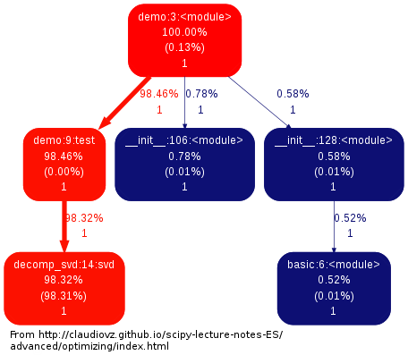
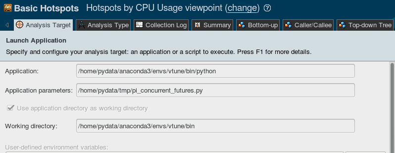
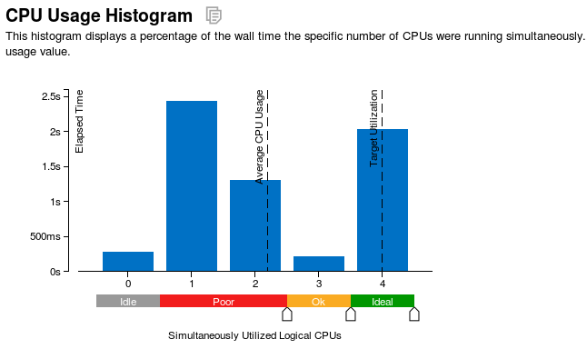
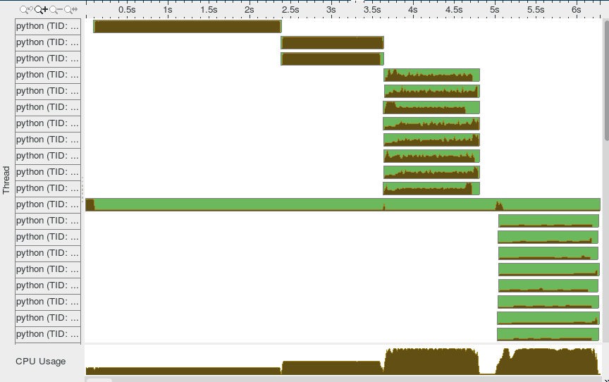
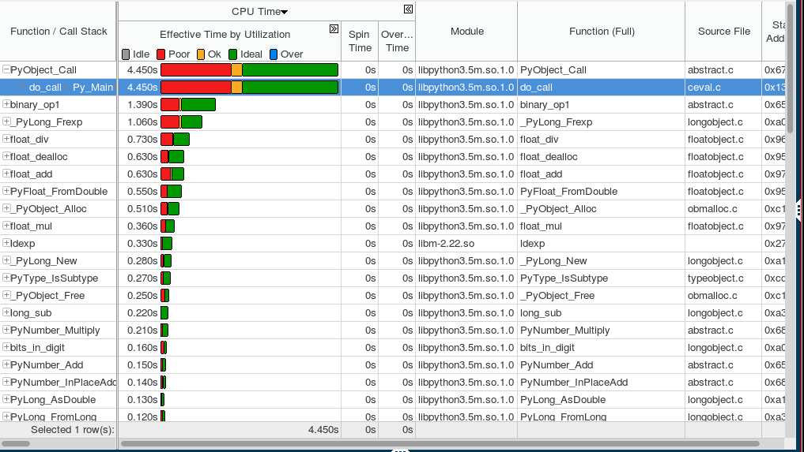
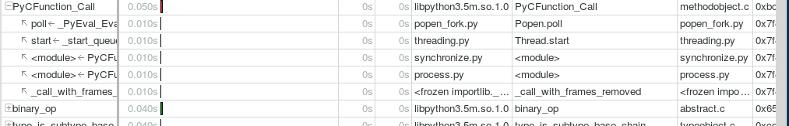
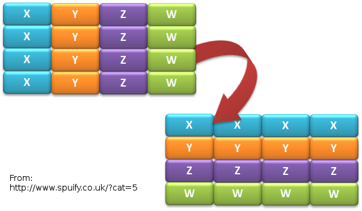

.. What's New in High-Performance Python? slides file, created by
   hieroglyph-quickstart on Sat Apr 30 21:13:03 2016.

What's New in High-Performance Python?
======================================

Graham Markall

@gmarkall

Hello! (About Me)
-----------------

* Background in Python libraries for HPC (PyOP2, Firedrake)
* Previously at Continuum working on / using Numba and Accelerate
* Joining Embecosm as a Compiler Engineer very soon

Overview
--------

Two aspects of performance:

* **Understanding** - profiling, benchmarking, ...
* **Optimisation** - algorithms, compilers, libraries ...

Some new tools / features for both of these:

* Accelerate data profiling
* Intel VTune Python support
* Numba features since PyData London 2015

My existing profiling toolbox
-----------------------------

- Python profile module
- Gprof2dot for generating a call graph (not interactive)

- Kernprof for line-by-line profiles of selected functions
- Google perftools if native code is involved (C extensions, Numba-compiled
  code)
- Kcachegrind for native code call graph visualisation

Accelerate Data Profiling
-------------------------

- Stdlib profiler measures execution count and time of functions
- But not *type* and *shape* of arguments
- Type & shape often used to guide optimisation
- So Accelerate Data Profiler records these too
- Numpy arrays shape and dtype recorded
- Interactive exploration in notebook

Accelerate Data Profiling Demo
==============================

Data Profiling Guidelines
-------------------------

- Use for interactive exploration in notebook
- Get an overview of data shapes, sizes, and types
- Help decide on optimisation strategy:

  - Very many small pieces of data, or very large arrays: use a GPU?
  - Middle ground - tricky to use GPU (one block per "item")
  - 32-bit types vs 64-bit: 64-bit slow on consumer GPUs
- Can many calls be batched into a single call, then JIT?
- Build specialisations for common cases - e.g. simplified 1D implementation

Intel VTune
-----------

- Profiles Python and native code, multiple threads and processes
- Statistical profiler - samples the call stack at regular intervals (e.g. 10ms)

  - Low overhead
  - <100% accuracy
- Single GUI / interface for both languages
- Works out of the box with Anaconda

VTune short example
-------------------

- Russel Winder's computing Pi example, using ``concurrent.futures``

.. code::

   def processSlice(id, sliceSize, delta):
       sum = 0.0
       for i in range(1 + id * sliceSize, (id + 1) * sliceSize + 1):
           x = (i - 0.5) * delta
           sum += 1.0 / (1.0 + x * x)
       return sum

   def execute(processCount):
       n = 10000000
       delta = 1.0 / n
       sliceSize = n // processCount
       with ProcessPoolExecutor(max_workers=processCount) as e:
           results = [e.submit(processSlice, i, sliceSize, delta)
                      for i in range(processCount)]
           pi = 4.0 * delta * sum(item.result() for item in results)

Session setup
-------------

- Execute with 1, 2, 8, and 32 processes

.. code::

   execute(1)
   execute(2)
   execute(8)
   execute(32)

Basic hotspots analysis
-----------------------

Produces CPU usage summary:

VTune CPU Timeline
------------------

VTune function summary
----------------------

VTune Python functions in summary
---------------------------------

- Python functions alongside native in summary:

- Sometimes requires expanding ``PyCFunction_Call`` or methods ending with
  ``_Eval``

VTune Guidelines
----------------

When is VTune the tool to use?

- Profiling a mix of native and Python code
- Using multiple threads / processes and releasing the GIL. Examples:

  - Numba ``@jit(nopython=True, nogil=True)``
  - Cython ``with nogil:`` / ``cdef ... nogil:``
  - Numpy array operations
  - Some Scipy operations
  - Pandas ``groupby`` - and others(?)
  - scikit-image
  - ... probably more!

New Numba Features (0.18 - 0.25)
--------------------------------

Including:

* Parallel / cuda ufuncs and gufuncs
* Generated JIT functions
* JIT classes
* CFFI support
* Extending Numba with overloading
* Improved support for use with Spark and Dask
* More Numpy functions supported in nopython mode

Quick Numba intro
-----------------

.. code-block:: python

    from numba import jit

    @jit
    def mandel(x, y, max_iters):
        c = complex(x,y)
        z = 0j
        for i in range(max_iters):
            z = z*z + c
            if z.real * z.real + z.imag * z.imag >= 4:
                return 255 * i // max_iters

        return 255

============================= =====
CPython                       1x
Numpy array-wide operations   13x
Numba (CPU)                   120x
Numba (NVidia Tesla K20c)     2100x
============================= =====

Parallel & CUDA ufuncs / gufuncs
--------------------------------

.. code::

   @vectorize([float64(float64, float64)])
   def rel_diff_serial(x, y):
        return 2 * (x - y) / (x + y)

   @vectorize(([float64(float64, float64)]), target='parallel')
   def rel_diff_parallel(x, y):
       return 2 * (x - y) / (x + y)

For 10^8 elements, on my laptop (i7-2620M, 2 cores + HT):

.. code::

   %timeit rel_diff_serial(x, y)
   # 1 loop, best of 3: 556 ms per loop

   %timeit rel_diff_parallel(x, y)
   # 1 loop, best of 3: 272 ms per loop

Parallel / CUDA (g)ufunc guidelines
-----------------------------------

- Add ``target='parallel'`` or ``target=cuda`` to ``@vectorize`` decorator
- Need to specify argument types (`Issue #1870 <https://github.com/numba/numba/issues/1870>`_)

  - Incorrect: ``@vectorize(target='parallel')``)
  - Correct: ``@vectorize([args], target='parallel')``
- Parallel target: speedup for all but the most simple functions
- CUDA target: overhead of copy to and from device

Generated functions
-------------------

- Dispatch to different function implementations based on type
- Inspired by Julia's generated functions

Dispatch based on argument:

- type (a scalar, an array, a list, a set, etc.)
- properties (number of dimensions, dtype, etc.)

Generated function example: (1/3)
---------------------------------

1-norm for scalar, vector and matrix:

.. code::

   def scalar_1norm(x):
       '''Absolute value of x'''
       return math.fabs(x)

   def vector_1norm(x):
       '''Sum of absolute values of x'''
       return np.sum(np.abs(x))

   def matrix_1norm(x):
       '''Max sum of absolute values of columns of x'''
       colsums = np.zeros(x.shape[1])
       for i in range(len(colsums)):
           colsums[i] = np.sum(np.abs(x[:, i]))
       return np.max(colsums)

Generated function example (2/3)
--------------------------------

JITting into a single function using ``@generated_jit``:

.. code::

   def bad_1norm(x):
       raise TypeError("Unsupported type for 1-norm")

   @generated_jit(nopython=True)
   def l1_norm(x):
       if isinstance(x, types.Number):
           return scalar_1norm
       if isinstance(x, types.Array) and x.ndim == 1:
           return vector_1norm
       elif isinstance(x, types.Array) and x.ndim == 2:
           return matrix_1norm
       else:
           return bad_1norm

Generated function example (3)
------------------------------

Calling the generated function:

.. code::

   # Calling

   x0 = np.random.rand()
   x1 = np.random.rand(M)
   x2 = np.random.rand(M * N).reshape(M, N)

   l1_norm(x0)
   l1_norm(x1)
   l1_norm(x2)

   # TypeError("Unsupported type for 1-norm")
   l1_norm(np.zeros((10, 10, 10))

Generated functions guidelines
------------------------------

- Looks in ``numba.types`` to see types and attributes
- Example types: ``Array``, ``Number``, ``Integer``, ``Float``, ``List``
- Example attributes: array ``ndim``, array ``dtype``, tuple ``dtype`` or
  ``types``
- ``Buffer`` is the base for a lot of things, including ``Array``
- Always have a "fallback" case that raises an error
- Missing case in type dispatch resulting in return value of ``None``:

.. code::

   File "/home/pydata/anaconda3/envs/pydata/lib/python3.5/inspect.py", line 2156,
            in _signature_from_callable
       raise TypeError('{!r} is not a callable object'.format(obj))
   TypeError: None is not a callable object

JIT Classes
-----------

- Useful for holding related items of data in a single object
- Allows transforming *Array-of-Structs* to *Struct-of-Arrays*
- Can improve performance when accessing a particular member of every entry
- AoS to SoA article from Intel:
  https://software.intel.com/en-us/articles/memory-layout-transformations

JIT Class AoS to SoA example (1/3)
----------------------------------

Original AoS layout using a structured dtype:

.. code::

   dtype = [
       ('x', np.float64),
       ('y', np.float64),
       ('z', np.float64),
       ('w', np.int32)
   ]

   aos = np.zeros(N, dtype)

   @jit(nopython=True)
   def set_x_aos(v):
       for i in range(len(v)):
           v[i]['x'] = i

   set_x_aos(aos)

JIT Class SoA to AoS example (2/3)
----------------------------------

.. code::

   vector_spec = [
       ('N', int32),
       ('x', float64[:]),
       ('y', float64[:]),
       ('z', float64[:]),
       ('w', int32[:])
   ]

   @jitclass(vector_spec)
   class VectorSoA(object):
       def __init__(self, N):
           self.N = N
           self.x = np.zeros(N, dtype=np.float64)
           self.y = np.zeros(N, dtype=np.float64)
           self.z = np.zeros(N, dtype=np.float64)
           self.w = np.zeros(N, dtype=np.int32)

   soa = VectorSoA(N)

JIT Class SoA to AoS example (3/3)
----------------------------------

.. code::

   # Example iterating over x with the AoS layout:

   @jit(nopython=True)
   def set_x_aos(v):
       for i in range(len(v)):
           v[i]['x'] = i

   # Example iterating over x with the SoA layout:

   @jit(nopython=True)
   def set_x_soa(v):
       for i in range(v.N):
           v.x[i] = i

JIT Class guidelines
--------------------

- Use for holding collections of related data
- Reducing the number of parameters to a ``@jit`` function
- Or for performance gain through AoS to SoA transformation
- Using ``_`` or ``__`` not supported yet - see `PR #1851 <https://github.com/numba/numba/pull/1851>`_
- Common error: assigning to an undeclared field or field of the wrong type
- Example: spec says ``np.int32``, assigning ``np.float64``:

.. code::

   numba.errors.LoweringError: Failed at nopython
       (nopython mode backend)
   Internal error:
   TypeError: Can only insert i32* at [4] in
       {i8*, i8*, i64, i64, i32*, [1 x i64], [1 x i64]}:
       got float*

CFFI and Numba
--------------

- C Foreign Function Interface for Python (CPython & PyPy)
- Reads C header files and generates Python interface
- PDL 2015: Romain Guillebert - "Why C extensions are evil"

Two modes:

- Inline: wrapper generated and compiled at runtime
- Out-of-line: at runtime a previously-compiled wrapper is loaded

CFFI / Numba demo
-----------------

- Goal: wrap Intel's Vector Maths Library (VML) and use it from Numba
- VML is a fast library for computations on arrays

  - e.g. sin, cos, exp, sqrt, etc.
- Wrapping by hand would be very time consuming

*Note:* this is an example of a general procedure to wrap a library and use it
with Numba. The demo won't run without VML development files.

Accelerate from Continuum provides VML functions as ufuncs.

CFFI Guidelines
---------------

- Use the preprocessor to do the work for you
- Numba "just works" with inline modules because it can obtain type info
- Out-of-line modules requires ``register_module``
- For struct types, use ``register_type`` to tell Numba how to map the type
- Remember that C functions are not as dynamic as Python

  - Must use correct types for wrapped function
- Also, that C is dangerous

  - Buffer overruns are easy to create
  - ``ffi.from_buffer`` does not type check

Other New Numba Features
------------------------

- Extending Numba

  - Allows you to add support for additional types
  - Manual section with example (``Interval`` class):
  - http://numba.pydata.org/numba-doc/latest/extending/index.html
- Improved Spark and Dask support

  - CUDA now works in Spark and Dask
  - Fixed many performance issues

- More Numpy support (list of supported functions):

  - http://numba.pydata.org/numba-doc/latest/reference/numpysupported.html

Further Reading / Information
-----------------------------

- Notebooks and examples: https://github.com/gmarkall/tutorials/tree/master/pydata-london-2016/examples
- Python and Intel tools webinar, May 10th: https://go.continuum.io/high-performance-computing-ods-era
- Numba manual / changelog: http://numba.pydata.org/numba-doc/latest/index.html
- Anaconda Accelerate docs: https://docs.continuum.io/accelerate/index
- Numba tutorial: http://gmarkall.github.io/tutorials/pycon-uk-2015/#1
- Examples and exercises: https://github.com/gmarkall/tutorials/tree/master/pycon-uk-2015
